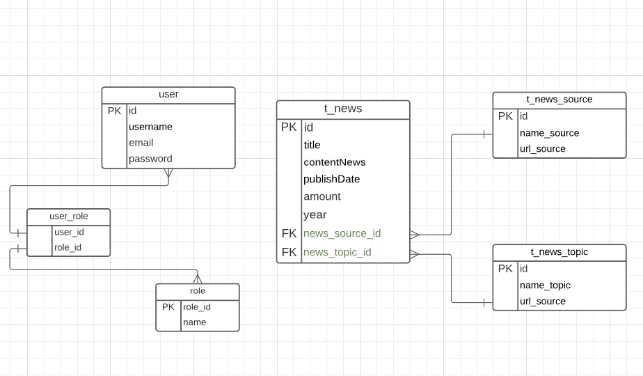

# Backend Test Assignment for the STRONG TEAM Summer Internship
Spring Boot is an application for storing, processing and displaying news

## 1.1 Technologies Used
- Java 8
- Spring Boot
- Spring Data JPA
- Spring Security
- PostgreSQL
- MVC
- JWT
- Hibernate
- Maven

## 1.2 Getting Started
To get started with this project, follow these steps:

1. Clone this repository onto your local machine.
   git clone https://github.com/YerzhanAs/Electronic_school.git
2. Build the application
   cd News_application_strong_team
   mvn clean package
3. Run the application
   java -jar target/Electronic_school-0.0.1-SNAPSHOT.jar
4. Create a PostgreSQL database with the name `news`.
5. Update the `application.properties` file with your database connection details:
```
server.port=8170
spring.datasource.url=jdbc:postgresql://localhost:5432/news
spring.datasource.username=
spring.datasource.password=

spring.datasource.driver-class-name=org.postgresql.Driver
spring.jpa.hibernate.ddl-auto=update
spring.jpa.properties.hibernate.show_sql=true
spring.jpa.properties.hibernate.dialect=org.hibernate.dialect.PostgreSQLDialect

# App Properties
app.jwtSecret=MegaLargeSigningSecretKeyForDemoApplicationMegaLargeSigningSecretKeyForDemoApplication
app.jwtExpirationMs=86400000
```
4. Run the project using `mvn spring-boot:run` command.
5. The project is now running and can be accessed at `http://localhost:8170/api/v1/`.

## 1.3  Schema DataBase


### Before starting the application, run the init.sql file

## 1.4 REST service

### 1.4.1 Registration User
```
POST http://localhost:8170/api/v1/auth/signup
Content-Type: application/json
{
"username": "Yerzhan",
"email": "yerzhan@gmail.com",
"password": "12345678",
"role": ["user"]
}

```
### 1.4.2 Login User
```
POST http://localhost:8170/api/v1/auth/signin
Content-Type: application/json
{
    "email": "yerzhan@gmail.com",
     "password": "12345678",
}
```

### 1.4.3 GET, POST, PUT, DELETE methods for news sources;
#### Before sending a request, do not forget to use the token you received after logging in

#### Get By Id
```
GET http://localhost:8170/api/v1/news-source/{id}
```

#### Post
```
POST http://localhost:8170/api/v1/news-source
Content-Type: application/json
{
    "name": "Nur Kz",
    "url": "https://www.nytimes.com"
}
```

#### PUT
```
PUT http://localhost:8170/api/v1/news-source/{id}
Content-Type: application/json
{
    "name": "Kazakhsatan Kz",
    "url": "https://www.nytimes.com"
}
```

#### Delete
```
DELETE http://localhost:8170/api/v1/news-source/{id}
```

### 1.4.4 GET, POST, PUT, DELETE methods for news
#### Before sending a request, do not forget to use the token you received after logging in

#### Get By Id
```
GET http://localhost:8170/api/v1/news/{id}
```

#### Post
```
POST http://localhost:8170/api/v1/news
Content-Type: application/json
{
   "title": "Breaking News: Election Results Announced",
  "content": "The election results were announced today",
  "publishDate": "2023-05-17T10:00:00",
  "newsSource": {
    "id": 1
  },
  "newsTopic": {
    "id": 1
  }

}
```

#### PUT
```
PUT http://localhost:8170/api/v1/news/{id}
Content-Type: application/json
{
    "title": "Breaking News: Election Results Announced",
  "content": "The election results were announced today",
  "publishDate": "2023-05-17T10:00:00",
  "newsSource": {
    "id": 1
  },
  "newsTopic": {
    "id": 1
  }
}
```

#### Delete
```
DELETE http://localhost:8170/api/v1/news/{id}
```

### 1.4.5 GET, POST, PUT, DELETE methods for news topics;
#### Before sending a request, do not forget to use the token you received after logging in

#### Get By Id
```
GET http://localhost:8170/api/v1/news-topic/{id}
```
#### Post
```
POST http://localhost:8170/api/v1/news-topic
Content-Type: application/json
{
    "name": "IT",
    "description": "News IT"
}
```

#### PUT
```
PUT http://localhost:8170/api/v1/news-topic/{id}
Content-Type: application/json
{
    "name": "IT IN Kazakhstan",
    "description": "News IT Kazakhstan"
}
```

#### Delete
```
DELETE http://localhost:8170/api/v1/news-topic/{id}
```

### 1.4.6 GET method for getting list of all news sources;
#### Get all news sources
```
GET http://localhost:8170/api/v1/news-source
```

### 1.4.7 GET method for getting list of all news topics;
#### Get all news topics
```
GET http://localhost:8170/api/v1/news-topic
```

### 1.4.8 GET method for getting list of all news (with pagination);
#### Get  list of all news (with pagination)
```
GET http://localhost:8170/api/v1/news/filter?page=2&size=1
```
#### Get  list of all news 
```
GET http://localhost:8170/api/v1/news/
```

### 1.4.9 GET method for getting list of news by source id (with pagination);
#### Get list of news by source id (with pagination)
```
GET http://localhost:8170/api/v1/news/filter-by-sourceid?sourceId=1&page=2&size=1
```

### 1.4.10 GET method for getting list of news by topic id (with pagination);
#### Get list of news by topic id (with pagination)
```
GET http://localhost:8170/api/v1/news/filter-by-topicid?topicId=1&page=2&size=1
```

## Part 2: Security with API token
I used spring security to configure the token. The token is automatically issued in json format after registration. The main thing is not to forget to insert a token when sending a request to /news, /news-topic, /news-source

## 1.6 Conclusion
This project that was implemented as a way to create a Spring Boot application for Rest, database, security.
